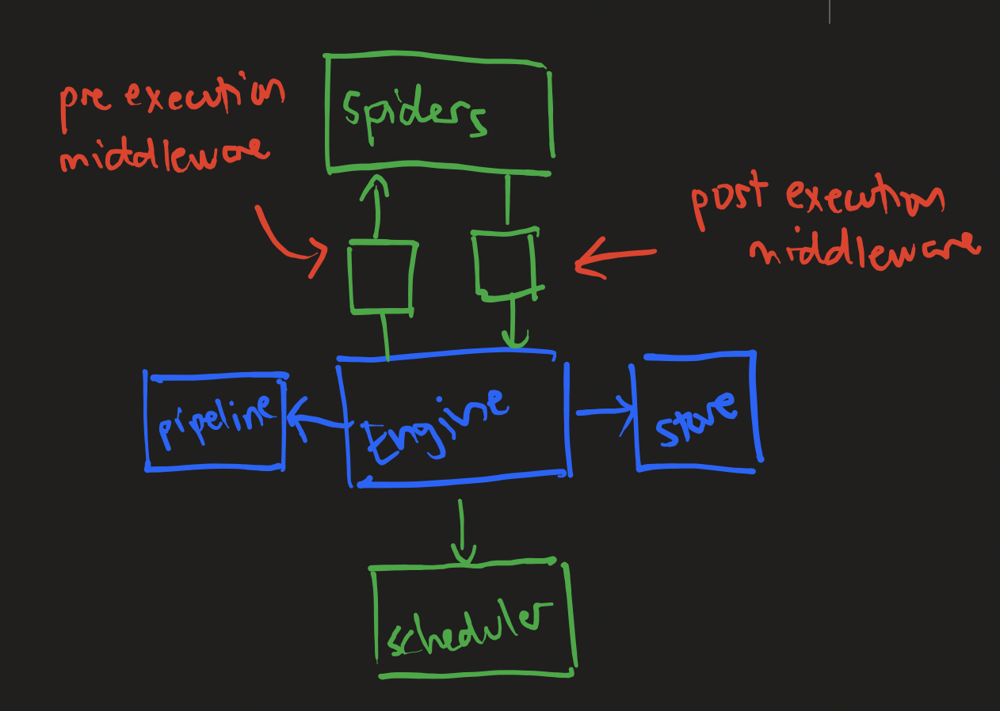
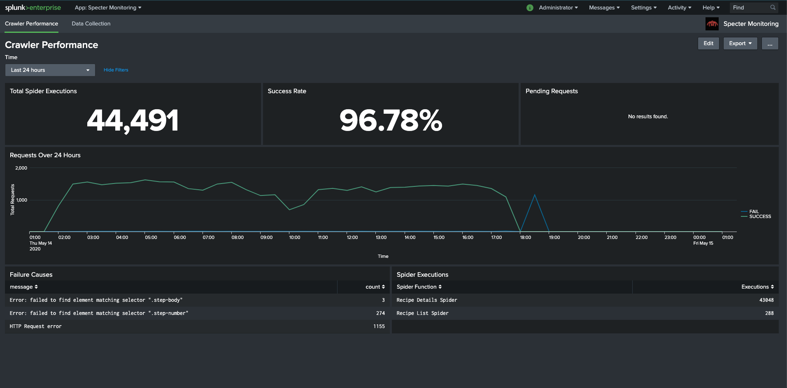
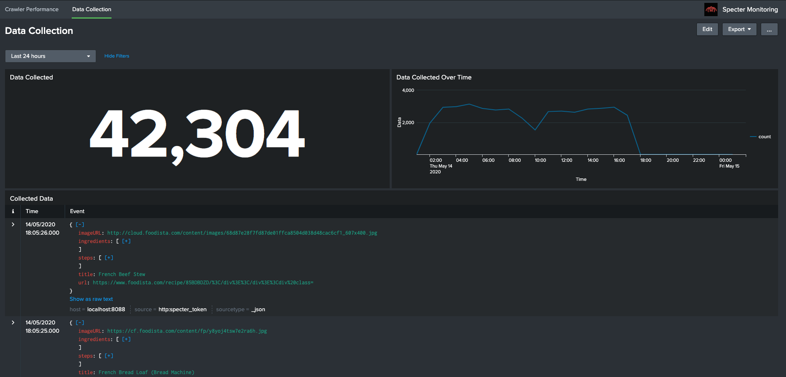

# Specter Web Crawler

## Purpose
The purpose of this application is to create an easily customisable
web crawler using the "apify" module with the scrapy architecture.
Specter is a web scraper that can be easily extended and scaled by making
minimal changes to the code and architecture. Apify was used to handle crawling
capabilities such as request management and data extraction.

## Getting Started
### Step 1: Create spiders
1. Create a new folder inside `src/spiders` e.g "sampleweb"
2. Create an index.js file with the following contents
    ```js
   module.exports = [];
    ```
3. Create a javascript file as a spider (e.g. `sampleweb.spider.js`) with the following contents
    ```js
   async function canExtract(request, page) {
       // condition that indicates that this
       // spider should be deployed to this page
   }
   async function extractData(request, page) {
       // functions for extracting the data from site
   }
   module.exports = {
       name: "MY SAMPLE SPIDER",
       canExtract,
       extractData
   };
    ```
4. Import the spider in the index.js file
    ```js
   const sampleSpider = require("sampleweb.spider");
   module.exports = [
       sampleSpider,
   ];
    ```

5. Inside `src/spiders/index.js`, add in your custom spider
    ```js
    const sampleSpiders = require("./sampleweb");
    module.exports = {
       // ...other spiders,
       sampleSpiders
    };
    ```

### Step 2: Customise scraping behaviour
1. Create a new configuration file inside `src/config` (e.g. sample.conf.js)
2. Paste the following config template
    ```js
    const { sampleSpiders } = require('../spiders');
    const { splunk: { splunkLogger }, writeToStore } = require('../middleware');
    const { stage } = require('../pipeline');
    const { SPLUNK_CONFIG } = require('../utils/constants');

    const config = {
      baseUrl: '<BASE_URL>',
      seedUrls: [
        '<STARTING_ROUTE_1>',
        '<STARTING_ROUTE_2>',
      ],
      pseudoUrls: [
        '<route-pattern>/[.*]'
      ],
      spiders: sampleSpiders,
      pipeline: [
        // stage.<PIPELINE_STAGE>
      ],
      maxRequestsPerCrawl: 100,
      maxConcurrency: 10,
      outputDir: '.output',
      outputFile: 'OUTPUT_NAME.csv',
      middleware: [
        splunkLogger(SPLUNK_CONFIG),
        writeToStore({ keyProp: '<KEY_PROPERTY>' })
      ]
    };

   module.exports = config;
    ```
3. Modify the configuration to your needs (look at the sample configurations provided)

## Architecture



|Component|Description|Modification required?|
|----|----|----|
|Spiders|Custom scripts which scrapes data from the website|You have to define your own spiders|
|Pipeline|Functions that is executed after data is scraped|Prebuilt pipelines are provided, but you can create your own.|
|Middleware|Functions executed before, after or during the spider script is executed|Prebuilt middlewares are provided, but you can create your own.|
|Engine|Main apify engine that puts together all the data|No modification required.|
|Store|Storage for the data scraped|Prebuilt storage options are available|
|Scheduler|Schedules and manages the request queues|No need|

## Monitoring crawler execution
Inside the `splunk` folder, I provided an app called "specter-monitoring". It provides dashboards that tells you information about the progress of the crawler and also information about the data. With Splunk, you can easily export and manipulate your scraped data through Splunk Web.

### Crawler Performance Dashboards
Displays number of spider executions, success rate of each execution and the number of pending requests when the spider is running.
It also identifies trends in failed executions and keeps track of the executions of each spider.



### Data Collection Dashboards
Contains information about the data collected and the changes in data over time.
The bottom panel contains raw event data which you can quickly export to CSV if required.



## Helpful Links
- https://sdk.apify.com/docs/guides/getting-started (underlying engine)
- https://pptr.dev/ (how to create crawling queries)
- https://www.splunk.com/ (download splunk)
